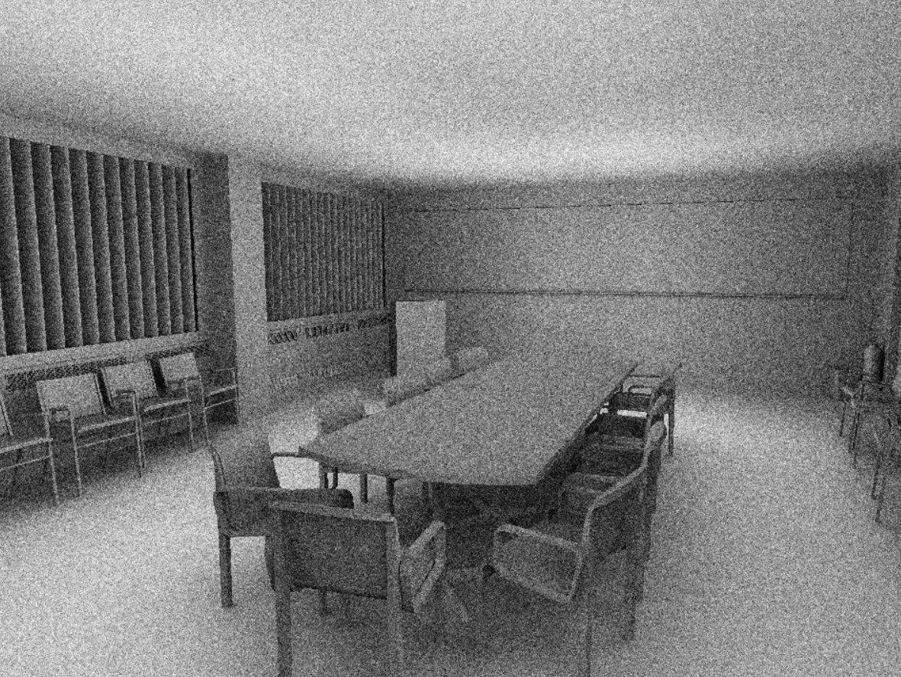
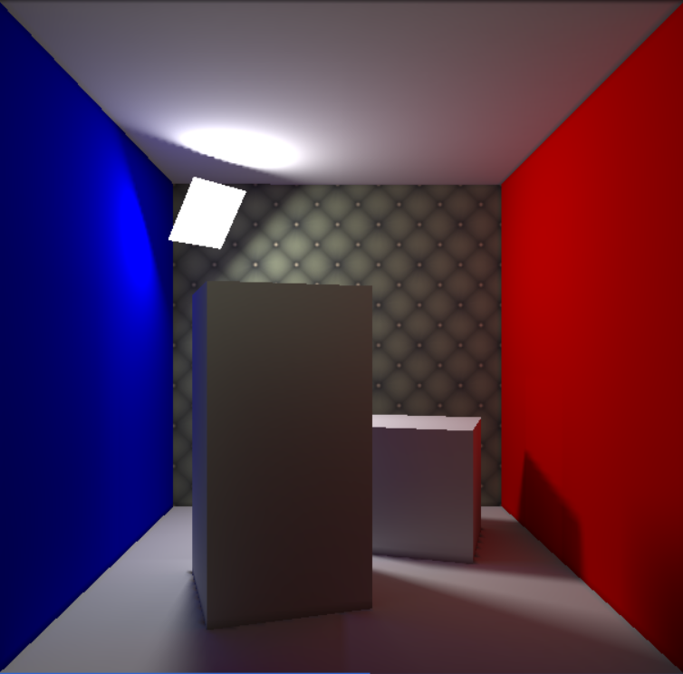

# An advanced attempt at computer graphics

> Still ongoing

This is an assignment repository for the course CS-E5520 Advanced Computer Graphics from Aalto University.

In this repository, an Nvidia Framework (FW) is further extended and provided by the course material. But three main assignments are for students to complete.

Here you can see what I learned and coded.

Please do not copy codes for your own assignment.

## Ambient Occlusion

- RayTracer is accelerated by **Bounding Volume Hierarchy (BVH)**.

- **Surface Area Heuristic (SAH)** is implemented for a better BVH construction.

## Global Illumination

- The diffuse GI is computed by **Radiosity** method. The result is a sum of direct lighting and two indirect bounces.

- The **Quasi Monte Carlo Sampling** with Halton sequence is implemented.

## 
